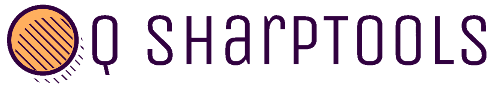
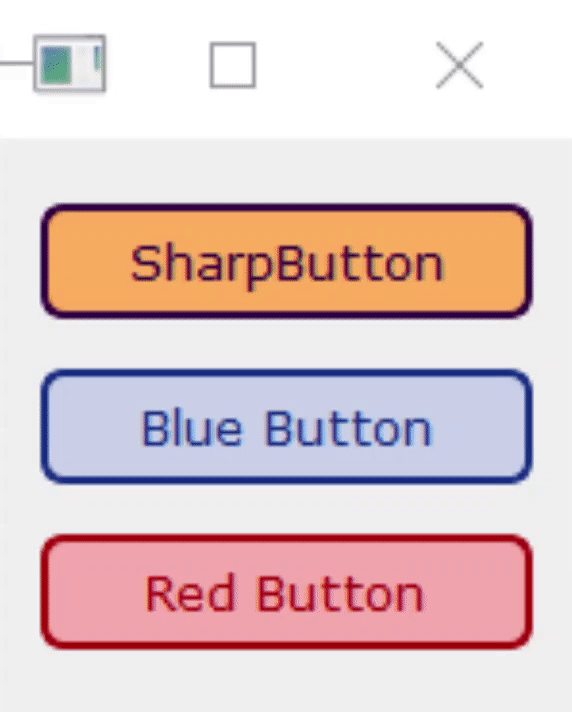

# Overview

**QSharpTools** is a library for **PyQt5** that includes better styled widgets for sharper desktop UI development.

# SharpButton

**SharpButton** an inherited class of **QPushButton,** styled using **QSS** and **QVariantAnimation.**

## Example Use

```python
import sys
from PyQt5.QtWidgets import QMainWindow, QApplication, QWidget, QVBoxLayout
from QSharpTools import SharpButton

class Window(QMainWindow):
    def __init__(self):
        super().__init__()
        self.width = 150
        self.height = 150
        self.xPos = 500
        self.yPos = 500
        self.initUI()

    def initUI(self):
        self.setGeometry(self.xPos, self.yPos, self.width, self.height)
        self.vBoxLayout = QVBoxLayout()

        self.button = SharpButton(
            primaryColor  = (49, 1, 64),
            secondaryColor = (255, 175, 94),
            borderWidth = 2,
            borderRadius = 6
        )
        self.button.setText("SharpButton")
        self.vBoxLayout.addWidget(self.button)

        self.blueButton = SharpButton(
            primaryColor  = (17, 46, 133),
            secondaryColor = (202, 209, 232),
            borderWidth = 2,
            borderRadius = 6
        )
        self.blueButton.setText("Blue Button")
        self.vBoxLayout.addWidget(self.blueButton)

        self.redButton = SharpButton(
            primaryColor  = (171, 3, 3),
            secondaryColor = (247, 173, 173),
            borderWidth = 2,
            borderRadius = 6
        )
        self.redButton.setText("Red Button")
        self.vBoxLayout.addWidget(self.redButton)

        self.centralWidget = QWidget(self)
        self.centralWidget.setLayout(self.vBoxLayout)
        self.setCentralWidget(self.centralWidget)
        self.show()

if __name__ == "__main__":
    app = QApplication(sys.argv)
    myWin = Window()
    sys.exit(app.exec_())
```


## Constructors & Methods

[SharpButton()](#SharpButton)

[setPrimaryColor()](#setPrimaryColor)

[setSecondaryColor()](#setSecondaryColor)

[setParentBackgroundColor()](#setParentBackgroundColor)

[setFont](#setFont)

[setBorder](#setBorder)

## SharpButton()

```python
SharpButton(parent = None,
            primaryColor = (0, 179, 60, 255),
            secondaryColor = (204, 255, 221, 255),
            parentBackgroundColor = (240, 240, 240, 255),
            fontFamily = "Verdana",
            fontSize = 8,
            fontWeight = "normal",
            borderStyle = "solid",
            borderWidth = 1,
            borderRadius = 2)
```

**Parameters:**

- *primaryColor:*
  - [QColor](https://doc-snapshots.qt.io/qtforpython-dev/PySide2/QtGui/QColor.html) object, RGBA tuple, RGBA unsigned 32-bit integer, or RGBA string
  - Normal text color and background color on hover
- *secondaryColor:*
  - [QColor](https://doc-snapshots.qt.io/qtforpython-dev/PySide2/QtGui/QColor.html) object, RGBA tuple, RGBA unsigned 32-bit integer, or RGBA string
  - Normal background color and the text color on hover
- *parentBackgroundColor:*
  - [QColor](https://doc-snapshots.qt.io/qtforpython-dev/PySide2/QtGui/QColor.html) object, RGBA tuple, RGBA unsigned 32-bit integer, or RGBA string
  - Needed to apply a size change effect when clicked
- *fontFamily:*
  - string representing name of font family
- *fontSize:*
  - integer representing font size
- *fontWeight:*
  - string representing font weight
- *borderStyle:*
  - string representing border style
- *borderWidth:*
  - integer representing border width
- *borderRadius*
  - integer representing border radius

## setPrimaryColor()

**Return type:** bool

**Parameters:**

- *color:* [QColor](https://doc-snapshots.qt.io/qtforpython-dev/PySide2/QtGui/QColor.html) object, RGBA tuple, RGBA unsigned 32-bit integer, or RGBA string

**Description:** set primary color.

## setSecondaryColor()

**Return type:** bool

**Parameters:**

- *color:* [QColor](https://doc-snapshots.qt.io/qtforpython-dev/PySide2/QtGui/QColor.html) object, RGBA tuple, RGBA unsigned 32-bit integer, or RGBA string

**Description:** set secondary color.

## setParentBackgroundColor()

**Return type:** bool

**Parameters:**

- *color:* [QColor](https://doc-snapshots.qt.io/qtforpython-dev/PySide2/QtGui/QColor.html) object, RGBA tuple, RGBA unsigned 32-bit integer, or RGBA string

**Description:** set background color of parent widget.

## setFont()

**Return type:** bool

**Parameters:**

- *fontFamily = None:* string representing name of font family
- *fontSize = None:* integer representing font size
- *fontWeight = None:* string representing font weight

**Description:** set font properties.

## setBorder()

**Return type:** bool

**Parameters:**

- *borderStyle = None:* string representing border style
- *borderWidth = None:* integer representing border width
- *borderRadius = None:* integer representing border radius

**Description:** set font properties.